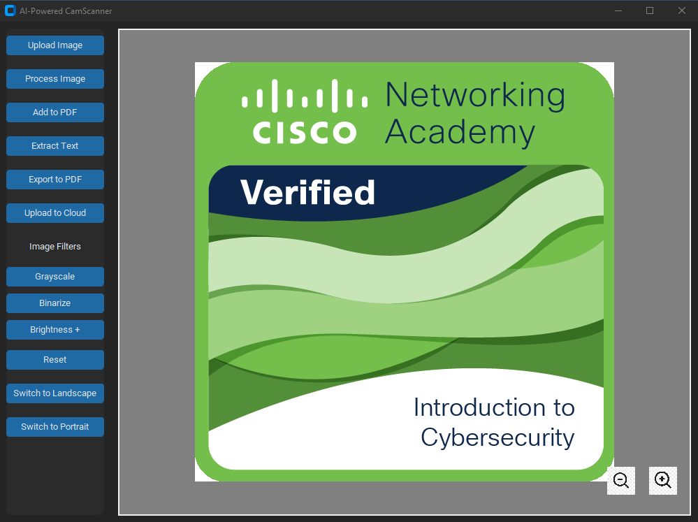
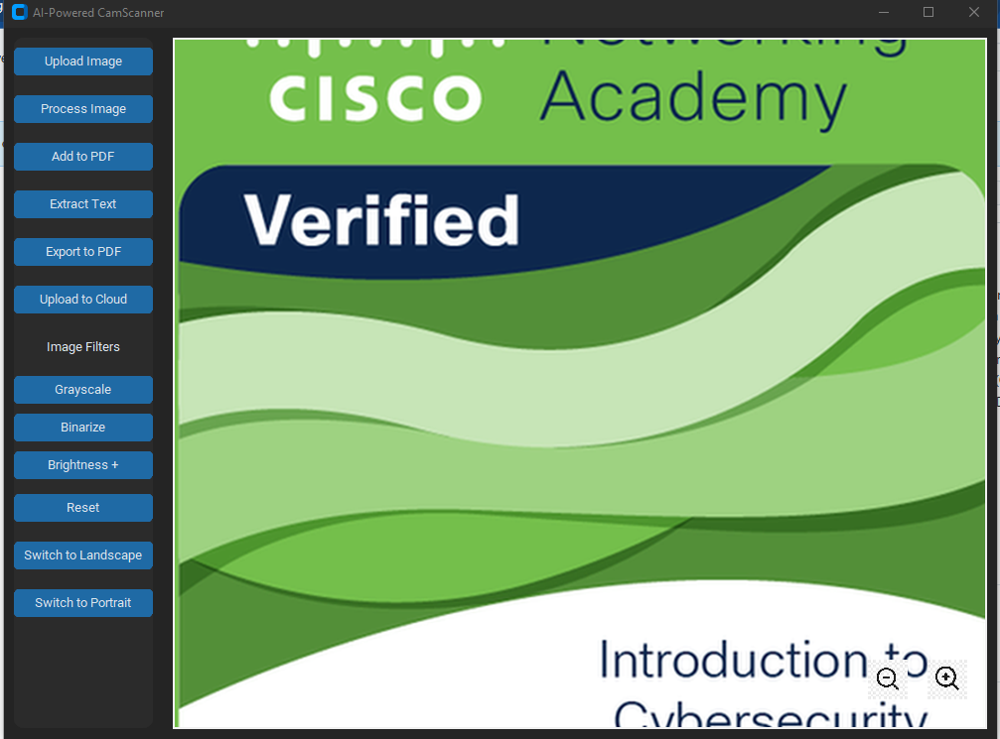

# AI-Powered CamScanner

An AI-powered document scanner application built with Python using the **CustomTkinter** library for the GUI, **OpenCV** for image processing, **Pytesseract** for OCR (Optical Character Recognition), and **FPDF** for PDF generation. The application supports features such as image upload, processing (including text extraction and applying filters), saving scanned images as PDFs, and uploading scanned PDFs to cloud storage (AWS S3).

## Features

- **Upload Image**: Allows users to upload an image to be processed.
- **Process Image**: Automatically detects and processes the uploaded image for further actions (e.g., applying filters, cropping).
- **Add to PDF**: Allows adding processed images to a PDF file.
- **Export to PDF**: Exports the processed images into a single PDF file.
- **Text Extraction**: Uses **Pytesseract** to extract text from the processed image.
- **Upload to Cloud**: Uploads the generated PDF to **AWS S3** storage.
- **Filters**: Apply grayscale, binarization, and brightness filters to the image.
- **Switch Image Orientation**: Switch between portrait and landscape modes.
- **Zoom and Move**: Zoom in/out and move the image inside the canvas.

## Requirements

### Python 3.x
- **CustomTkinter**: A modern Tkinter library for creating beautiful GUIs.
- **OpenCV**: A powerful library for image processing and computer vision tasks.
- **Pytesseract**: A Python wrapper for Google's Tesseract OCR.
- **FPDF**: A library to generate PDFs.
- **boto3**: AWS SDK for Python to interact with AWS services like S3.
- **Pillow**: A Python Imaging Library (PIL) fork for image manipulation.

You can install the required libraries using `pip`:

```bash
pip install customtkinter opencv-python pytesseract fpdf boto3 pillow numpy
```

### Getting Started
1. Clone the Repository:

- Clone the repository to your local machine.
```bash
git clone https://github.com/kayung-developer/Document-Scanner.git
cd Document-Scanner
```
2. Install Dependencies:

- Install all required Python packages.
```bash
pip install -r requirements.txt
```
3. Tesseract OCR:

- Ensure that Tesseract OCR is installed on your system. You can download it from here.

- After installation, update the path to the Tesseract executable in the script:
```bash
pytesseract.pytesseract.tesseract_cmd = r'C:\Program Files\Tesseract-OCR\tesseract.exe'

```
4. AWS Configuration:

- Set up your AWS credentials with your AWS_ACCESS_KEY and AWS_SECRET_KEY.

5. Run the Application:

- After setting up everything, you can run the application using:
```bash
python scanner.py
```
### Application Overview
#### GUI Layout
Control Panel (Left Side):

1. Upload Image: Allows users to upload an image.
2. Process Image: Processes the uploaded image for further actions.
3. Add to PDF: Adds the processed image to the PDF.
4. Extract Text: Extracts text from the processed image using OCR.
5. Export to PDF: Saves all processed images to a PDF.
6. Upload to Cloud: Uploads the PDF to AWS S3.
7. Filters: Provides options to apply grayscale, binarize, or adjust brightness to the image.
8. Orientation Buttons: Allows switching between portrait and landscape modes.

Image Display (Right Side):

1. Displays the uploaded or processed image.
2. Provides a zoom in/out and move functionality with clickable buttons/icons.

#### Image Processing
1. Edge Detection: The app applies GaussianBlur and Canny edge detection to find document contours.
2. Perspective Transformation: The app uses a four-point perspective transformation to straighten the document if it's skewed.
3. OCR: Uses Pytesseract to extract text from the processed image.
#### Cloud Upload
- The app integrates with AWS S3 to upload the generated PDFs. Make sure you have an AWS account and create an S3 bucket before using this feature. You will need to provide your AWS_ACCESS_KEY, AWS_SECRET_KEY, and AWS_REGION.

### Screenshots




### Troubleshooting
1. Error: "Tesseract OCR not found": Ensure that Tesseract OCR is correctly installed and the path is set in the script.
2. Error: "AWS Credentials not configured properly": Check your AWS credentials and ensure that your environment is properly configured.
3. Error: "Image not uploaded": Ensure that a valid image file is selected during the upload step.

### License
- This project is licensed under the MIT License - see the LICENSE file for details.

### Acknowledgments
- OpenCV: Used for image processing and computer vision tasks.
- Pytesseract: Used for Optical Character Recognition (OCR) to extract text from images.
- FPDF: Used to generate PDF documents from scanned images.
- boto3: Used to interact with AWS S3 for cloud storage.
- CustomTkinter: Used to create the modern and beautiful GUI interface.

### Future Improvements
- Add support for more image formats (e.g., TIFF, BMP).
- Implement additional filters for enhanced image processing.
- Improve the AI model for better text extraction accuracy.
- Implement multi-page PDF support.
- Feel free to contribute to the project by forking the repository, reporting issues, or submitting pull requests.

```vbnet
This `README.md` provides detailed instructions on how to set up and use the AI-powered CamScanner application. 
```
